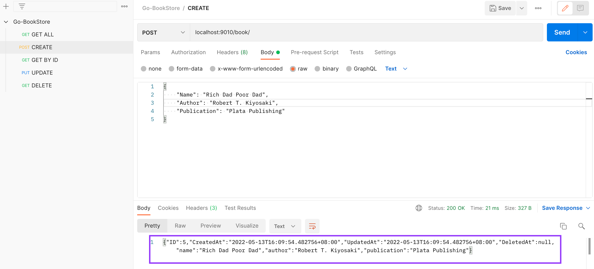
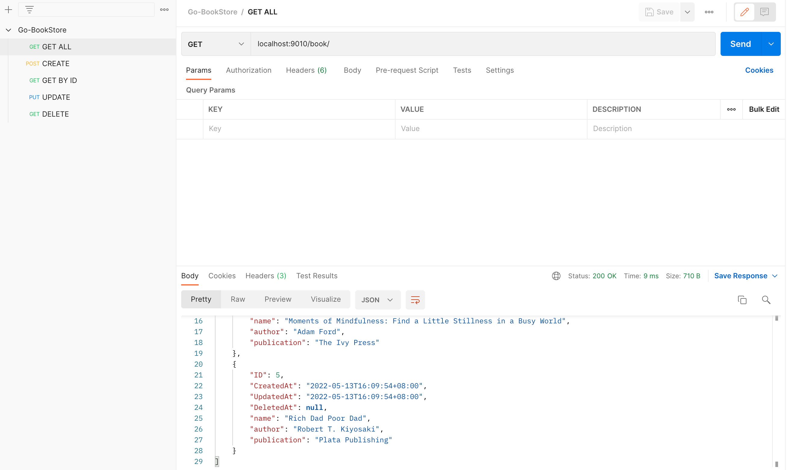
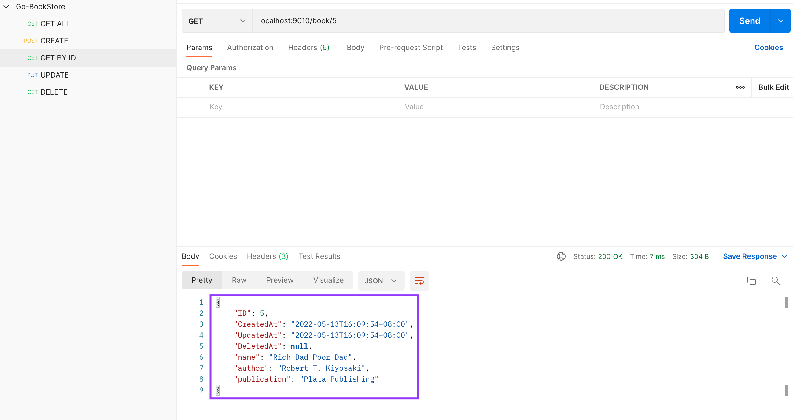
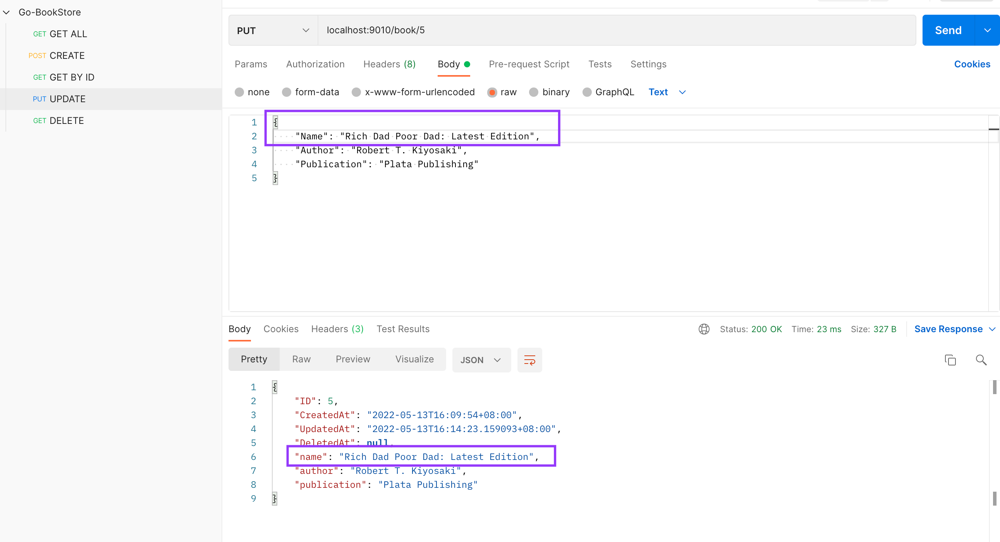
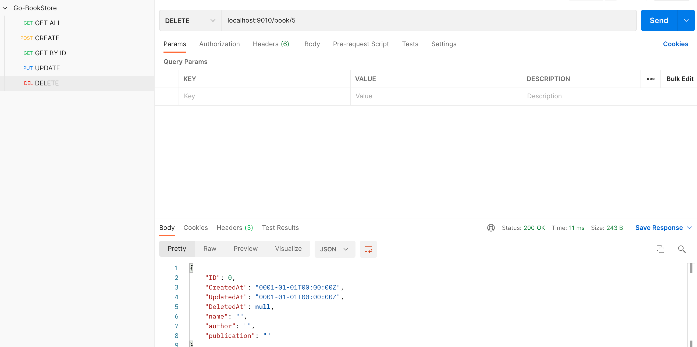

## QnA

Underscore in front of an import [Link] (https://stackoverflow.com/questions/21220077/what-does-an-underscore-in-front-of-an-import-statement-mean)

## Go package dependencies embeddings

[Link](https://gist.github.com/bzz/d91a69b7622e2d3b87154aae398ed9d1)

## Brew Install
[Link](https://phoenixnap.com/kb/install-homebrew-on-mac)

## Brew Install SQL

[Link](https://flaviocopes.com/mysql-how-to-install/)

## Connecting to a DB

[Link](https://gorm.io/docs/connecting_to_the_database.html)

## Test on POSTMAN

### Create a book 

### Get books 

### Get book by ID 

### Update book by ID 

### Delete book by ID 
